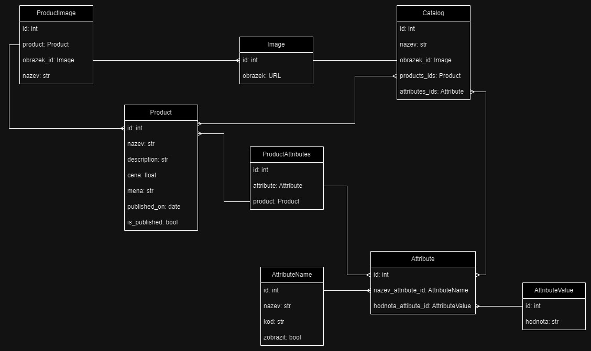

# Import Catalogs
## Description
Importing objects in json format and viewing imported data.
Data reception works in two modes. If the input is a single json object or a list of json objects.

## Stack technology
- Django
- DRF
- Docker

## Database structure

## Installation and Run
### Installation
- `git clone https://github.com/TheSaintDeer/Import-Catalogs.git `

### Run using docker
- `docker-compose up --build`

### Local run
Create a virtual environment
- `python3 -m venv env`
- `source env/bin/activate`

Install all packages
- `cd src/`
- `pip install -r requirements.txt`

Run project
- `sh start.sh`
